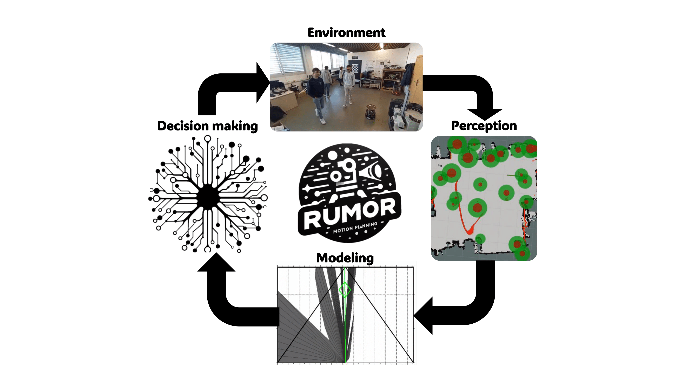

# RUMOR: Reinforcement learning for Understanding a Model of the Real world for navigation in dynamic environments
This repo provides the code of the work for out paper RUMOR: Reinforcement learning for Understanding a Model of the Real world for navigation in dynamic environments, published in Robotics and Autonomous Systems (RAS) in 2025.
# [Paper](https://www.sciencedirect.com/science/article/pii/S092188902500106X) || [Video](https://youtu.be/owF_Iw3BJPU)

## Abstract
Autonomous navigation in dynamic environments is a complex but essential task for autonomous robots, with recent deep reinforcement learning approaches showing promising results. However, the complexity of the real world makes it infeasible to train agents in every possible scenario configuration. Moreover, existing methods typically overlook factors such as robot kinodynamic constraints, or assume perfect knowledge of the environment. In this work, we present RUMOR, a novel planner for differential-drive robots that uses deep reinforcement learning to navigate in highly dynamic environments. Unlike other end-to-end DRL planners, it uses a descriptive robocentric velocity space model to extract the dynamic environment information, enhancing training effectiveness and scenario interpretation. Additionally, we propose an action space that inherently considers robot kinodynamics and train it in a simulator that reproduces the real world problematic aspects, reducing the gap between the reality and simulation. We extensively compare RUMOR with other state-of-the-art approaches, demonstrating a better performance, and provide a detailed analysis of the results. Finally, we validate RUMOR's performance in real-world settings by deploying it on a ground robot. Our experiments, conducted in crowded scenarios and unseen environments, confirm the algorithm's robustness and transferability.

<p align="center">
  
</p>

## Installation

This work needs ROS1, and has been tested with `noetic`. First, install required dependencies:
```
sudo apt-get install libcgal-dev
sudo apt-get install libmotif-dev
sudo apt-get install ros-noetic-stage-ros-dbgsym
```
Then, create a ROS workspace and clone necessary packages in `ws/src`, as well as this repo:
```
git clone https://github.com/dmartinezbaselga/RUMOR-gather-metrics
git clone https://github.com/dmartinezbaselga/RUMOR-Stage
git clone https://github.com/dmartinezbaselga/RUMOR-obstacle-detector
git clone https://github.com/dmartinezbaselga/RUMOR
```
Install `stable-baselines3`, the reinforcement learning libraries used:
```
pip install stable-baselines3[extra]
```
Install [DISLIN](https://www.dislin.de/index.html) for DOVS visualization.

### Installing baselines
If you would also like to try running the baselines, you have to install [this repo](https://github.com/dmartinezbaselga/intrinsic-rewards-navigation).

## Getting Started
### Training
Open `training_script.sh`. There, you will find the script used to train the different agents trained in the paper. You can set the following flags:
- `-r <n_obstacles> <n_robots>`: It currently supports only 1 robot.
- `-dqn_weights <file_name>`: Output file to save the trained parameters.
- `-orca_agents`: The obstacles move in circles avoiding each other using ORCA motion planner.
- `-sac / -crowdnav [gcn|tsrl|sarl]`: Select between RUMOR / baselines.
- `-collaborative`: Don't use the obstacle tracker to estimate the position and velocity of the obstacles. The default is using it.
- `-use_crowdnav_actions`: Don't use differential drive and acceleration restrictions. 
- `-curricular-goal`: The starting distance from the robot to the goal increments gradually during training.
- `-curricular_obstacles`: The number of obstacles increments gradually during training.
- `-random_n_obstacles`: The number of obstacles is randomized in every episode. 

Note that you don't need to train any agent, as the trained weights are included in this repo.

### Testing
Open `testing_script.sh`. There, you will find the script used to test the different agentsin the paper. You can set the same flags as for training. You need to set `-no_training` to use the trained weights and not override the ones you already have. Use `-t` to use a set of fixed pregenerated scenarios that make the experiments reproductible, and gather the metrics in a txt.

## Citation
If you use this work in your own research or wish to refer to the paper's results, please use the following BibTeX entries.
```bibtex
@article{martinez2025rumor,
title = {RUMOR: Reinforcement learning for Understanding a Model of the Real world for navigation in dynamic environments},
journal = {Robotics and Autonomous Systems},
pages = {105020},
year = {2025},
issn = {0921-8890},
doi = {https://doi.org/10.1016/j.robot.2025.105020},
author = {Diego Martinez-Baselga and Luis Riazuelo and Luis Montano},
}
```
## Bug Reports and Support
For issues related to the work, please contact:
- Diego Martinez-Baselga: `diegomartinez@unizar.es`

## Acknowledgements
This work was partially supported by MICIU/AEI/10.13039/501100011033 and ERDF/EU under grant PID2022-139615OB-I00 and grant PRE2020-094415, and Government of Aragón under grant DGA T45-23R.
